# 森林 3D モデル ビューアー
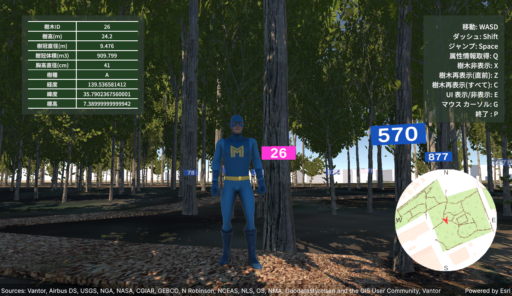

本リポジトリは、CSV で管理されている立木を位置、太さ等のデータから地図上に 3D 表示し、
サードパーソン形式で探索できる Unity プロジェクト (以下、本プロジェクト) です。

## 目次

- [本プロジェクトで利用しているデータについて](#本プロジェクトで利用しているデータについて)
- [開発時の動作環境](#開発時の動作環境)
- [本プロジェクトを実行するために必要な準備](#本プロジェクトを実行するために必要な準備)
    - [ArcGIS Maps SDK for Unity のダウンロードとインストール](#arcgis-maps-sdk-for-unity-のダウンロードとインストール)
        - [ArcGIS API キーの設定](#arcgis-api-キーの設定)
    - [European Forests のインストール](#european-forests-のインストール)
    - [樹木モデルのシーン追加](#樹木モデルのシーン追加)

    - [アプリケーション上で表示される内容について](#アプリケーション上で表示される内容について)
    - [アプリの操作方法について](#アプリの操作方法について  )

- [プロジェクトの設定を変更する](#プロジェクトの設定を変更する)
  - [表示する立木の CSV の設定](#表示する立木の-csv-の設定)
  - [既存の樹木モデルを削除](#既存の樹木モデルを削除)
  - [初期位置の設定を変更](#初期位置の設定を変更)
    - [プレイヤーの初期位置の変更](#プレイヤーの初期位置の変更)
    - [ミニマップの中心点を変更](#ミニマップの中心点を変更)
  - [参照するレイヤーの変更](#参照するレイヤーの変更)
    - [3D Object Scene Layer の変更](#3d-object-scene-layer-の変更)
    - [Elevation Layer の変更](#elevation-layer-の変更)
    - [樹木モデルの再生成](#樹木モデルの再生成)
- [ライセンス](#ライセンス)

## 本プロジェクトで利用しているデータについて
本プロジェクトで利用しているデータの一部は、東京都清瀬市に位置する[大林組技術研究所内の雑木林](https://www.obayashi.co.jp/obytri/facility/natural-wood/)を対象として、ヤマハ発動機株式会社が実施した立木位置および立木の直径等に関する計測・解析データであり、株式会社大林組から提供を受けたものです。なお、説明および検証目的のため、本データにはダミー情報が含まれています。

## 開発時の動作環境
- Unity Editor 6000.0.67f1
- ArcGIS Maps SDK for Unity 2.2.0

## 本プロジェクトを実行するために必要な準備
本プロジェクトは、~~ダウンロードもしくは~~クローンして、どなたでも利用することができます。
ダウンロードしてきたプロジェクトを利用するには以下のアセットをご用意ください。

### ArcGIS Maps SDK for Unity のダウンロードとインストール
本プロジェクトでは、[ArcGIS Maps SDK for Unity](https://developers.arcgis.com/unity/) を利用しています。
ArcGIS Maps SDK for Unity は Unity 用のプラグインで、ArcGIS の実世界のマップや 3D コンテンツを使用した 3D GIS アプリケーションを作成することができます。
プラグインのダウンロード方法は、ArcGIS Developers 開発リソース集の[インストールとセットアップ](https://esrijapan.github.io/arcgis-dev-resources/tips/unity/install-and-set-up/#3-%e3%83%97%e3%83%a9%e3%82%b0%e3%82%a4%e3%83%b3%e3%81%ae%e3%83%80%e3%82%a6%e3%83%b3%e3%83%ad%e3%83%bc%e3%83%89%e3%81%a8%e3%82%a4%e3%83%b3%e3%82%b9%e3%83%88%e3%83%bc%e3%83%ab)をご確認ください。

また、本プロジェクトで操作できるプレイヤーの 3D モデルは 米国 Esri 社が作成した [ArcGIS Maps SDK for Unity のサンプル集](https://github.com/Esri/arcgis-maps-sdk-unity-samples)で利用されている 3D モデルを利用しています。

#### ArcGIS API キーの設定
本プロジェクトでは、ArcGIS の API キーを使って認証を行います。
ArcGIS の API キーの取得や設定方法については ArcGIS Developers 開発リソース集の[ API キーの取得](https://esrijapan.github.io/arcgis-dev-resources/guide/get-api-key/)からご確認ください。本プロジェクトでは、API キーはベースマップの表示に使用します。
Unity Editor では、API キーを下記の手順で設定します。

1. 上部メニューの[ 編集 (Edits) ] をクリック
2. [ プロジェクト設定 (Project Settings) ] をクリック
3. Project Settings ウィンドウで [ ArcGIS Maps SDK ] の項目をクリック
4. [ API Key ] の項目に取得した API キーを入力

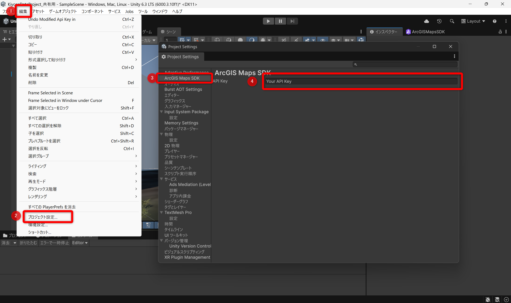

### European Forests のインストール
本プロジェクトでは、立木を表現する 3D モデルとして [European Forests](https://assetstore.unity.com/packages/3d/vegetation/trees/european-forests-realistic-trees-229716) を利用しています。このアセットには、多様な種類の樹木モデルが用意されています。
European Forests は、下記の手順でインストールすることができます。

1. [European Forests](https://assetstore.unity.com/packages/3d/vegetation/trees/european-forests-realistic-trees-229716) にアクセスし、アセットを取得

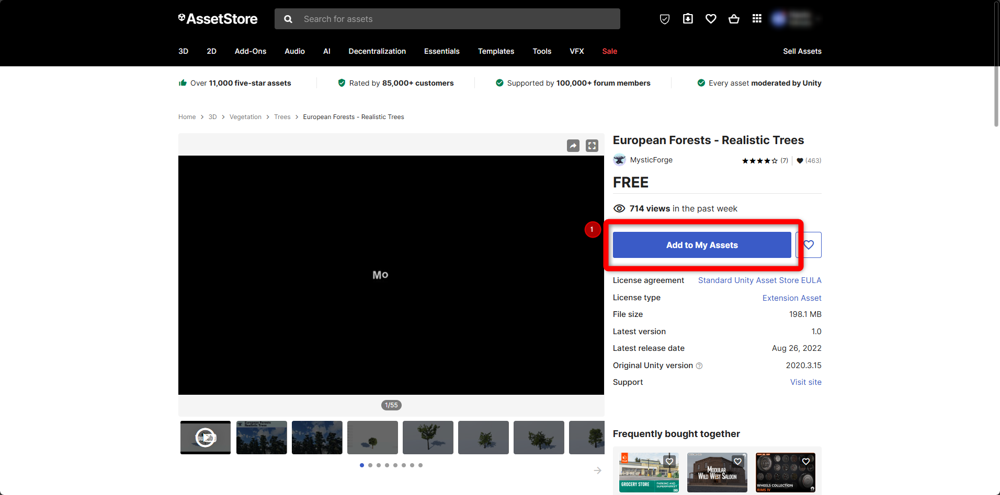

次の手順以降は Unity Editor でプロジェクトのシーンを開いた状態で実行します。

2. 上部メニューの[ウィンドウ (Window) ] をクリック 
3. [パッケージ マネージャー (Package Manager) ] をクリック
4. [マイ アセット (My Assets) ] を展開し、[European Forests] をクリック
5. インポートをクリック
6. 表示されたポップアップも右下のインポートをクリック

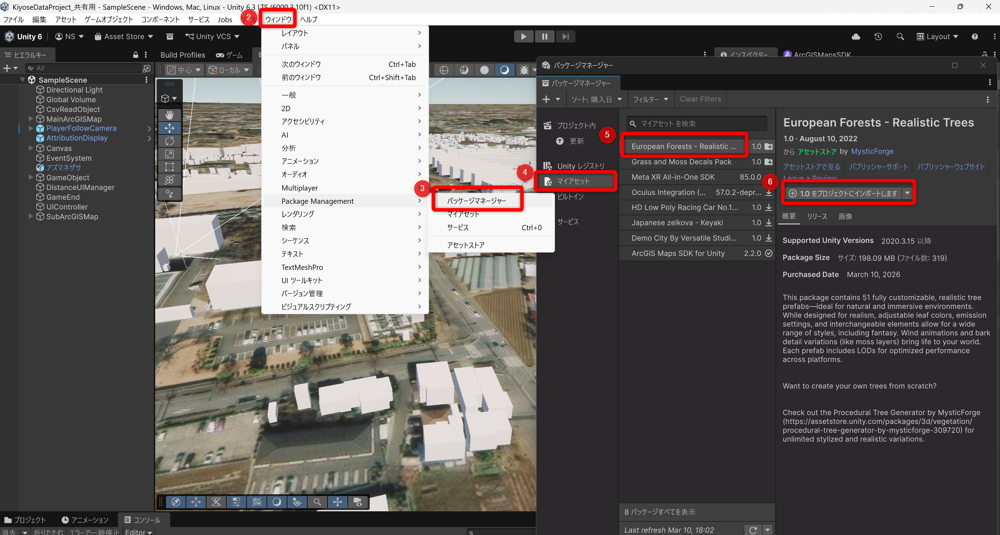
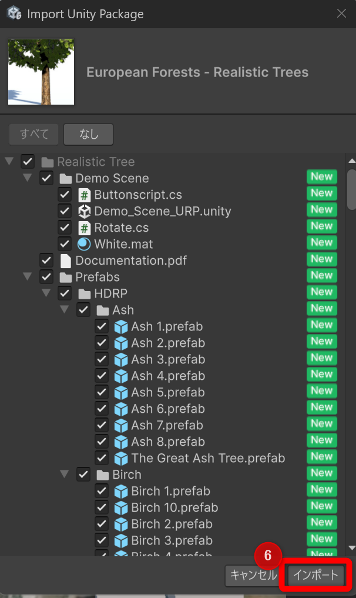

上記の手順を実行すると、パッケージ マネージャー (Package Manager) のプロジェクト内に European Forests が追加されていることを確認できます。

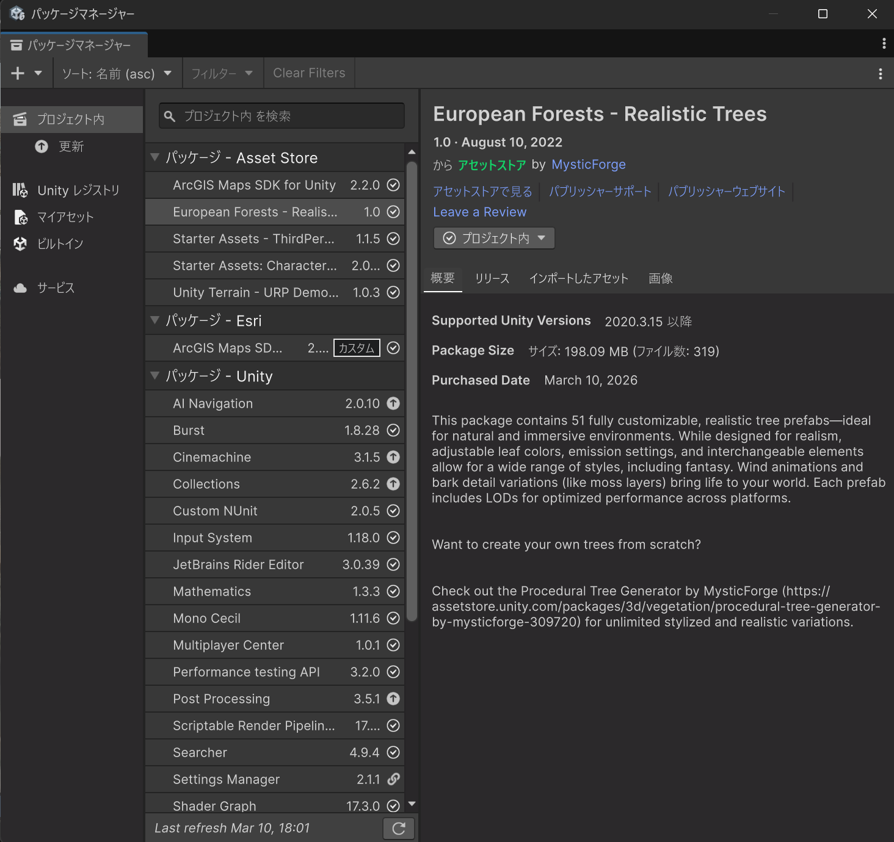

### 樹木モデルのシーン追加
上記でインストールした European Forests のモデルを Scene 上に配置します。本プロジェクトでは、European Forests 内の Prefab を加工して表示するため、CSV を `Assets\StreamingAssets` フォルダーに 格納すれば、Editor から自動で配置できるようになっています。

1. 上部メニューの[ツール (Tools) ] をクリック
2. [樹木 (Trees) ] をクリック
3. [Generate (From Streaming Assets) ] をクリック

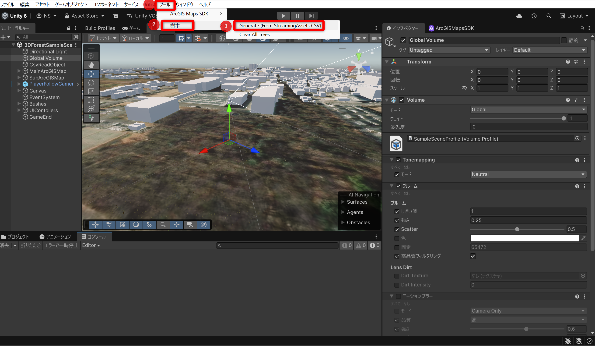

4. [ ヒエラルキー (hierarchy) ]ウィンドウで `TreeParent` オブジェクトの下に樹木_ID をオブジェクト名にした樹木モデルが生成されていることを確認

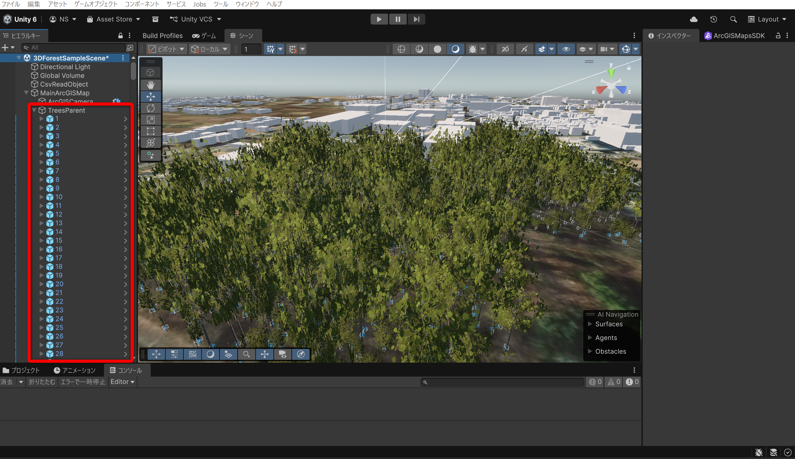

ここまでできたらプレイ ボタンを押して、ゲーム ビューで動作を確認してみましょう。

### アプリケーション上で表示される内容について
アプリケーション (以下、アプリ) で表示される情報についてご紹介します。

1. プレイヤーとなるキャラクター
2. 樹木の属性を表示するテーブル
3. アプリの操作方法
4. プレイヤーの現在地を確認できるミニマップ

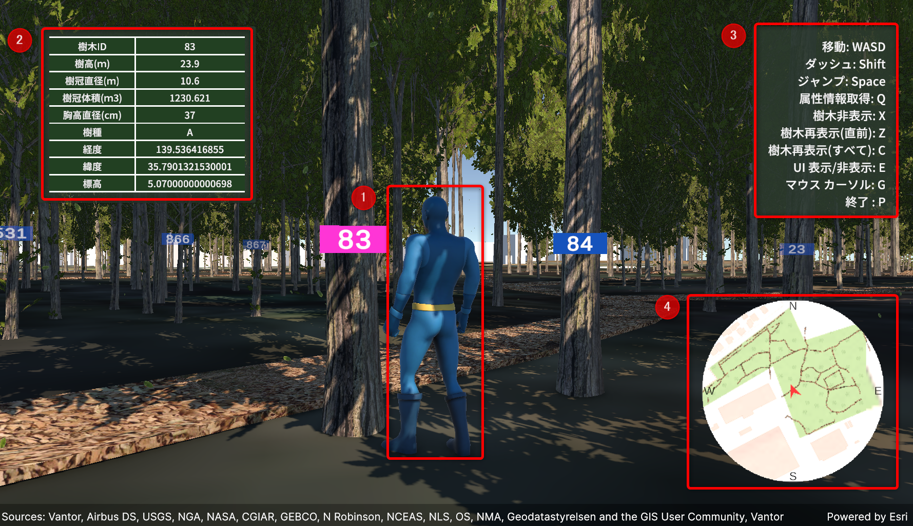

各樹木には樹木_ID が記載されたラベルが表示されており、プレイヤーを追従しているカメラの正面に表示されるように設定されています。
後述の[アプリの操作方法について](#アプリの操作方法について)に記載しますが、左上のテーブルに表示される樹木の属性情報は、Q キーを押すことで取得されます。
取得される属性情報は、プレイヤー周囲 0.5m の範囲にある選択状態になっている樹木のもので、該当する樹木のラベルはピンク色で表示されます。

アプリでは、樹木の非表示ができます。選択状態になっている樹木に対して X キーを押すと、その樹木は非表示になります。非表示にした樹木は、Z キーを押すことで最後に非表示にしたものから順に再表示することが可能です。また、C キーを押すと、これまでに非表示にしたすべての樹木が一括で再表示されます。なお、非表示の状態は一時的なものであり、アプリを終了するとすべての樹木が再表示されます。

### アプリの操作方法について
アプリの操作に使用するキーボードのキーと、各キーに割り当てられた操作方法について説明します。
なお、操作方法はアプリ画面右上のメニュー バーにも表示されています。

- 移動方法
    
    WASD キーには、前後左右の移動が割り当てられています。また、Shift キーを押しながら WASD キーを操作すると、走る動作になります。
    - W: 前方に進む
    - A: 左に進む
    - S: 後方に進む
    - D: 右に進む
    - Space: ジャンプ

- 樹木の属性取得
    - Q: 属性情報の取得

        プレイヤー周囲 0.5m の範囲にある選択状態になっている (ラベルがピンク色で表示されている) 樹木の属性情報を取得し、左上のテーブルに表示します。
- 樹木の表示制御
    - X: 選択状態になっている樹木を非表示にする
    - Z: 直前に非表示にした樹木を表示する
    - C: 非表示になった樹木をすべて表示する

- その他の操作
    - E: メニューの表示／非表示
        
        アプリ右上のメニュー バーおよび左下の属性情報テーブルの表示／非表示を切り替えます。
    - G: マウス カーソル
        
        マウス カーソルを表示し、アプリ外でのマウス操作をできるようにします。
    - P: アプリの終了

## プロジェクトの設定を変更する
ここからは、本プロジェクトの設定を変更して利用したい方向けに、その設定方法をご紹介します。
下記の手順を元に設定し、プレイ ボタンを押すとゲーム ビューで変更した内容が適用されます。  

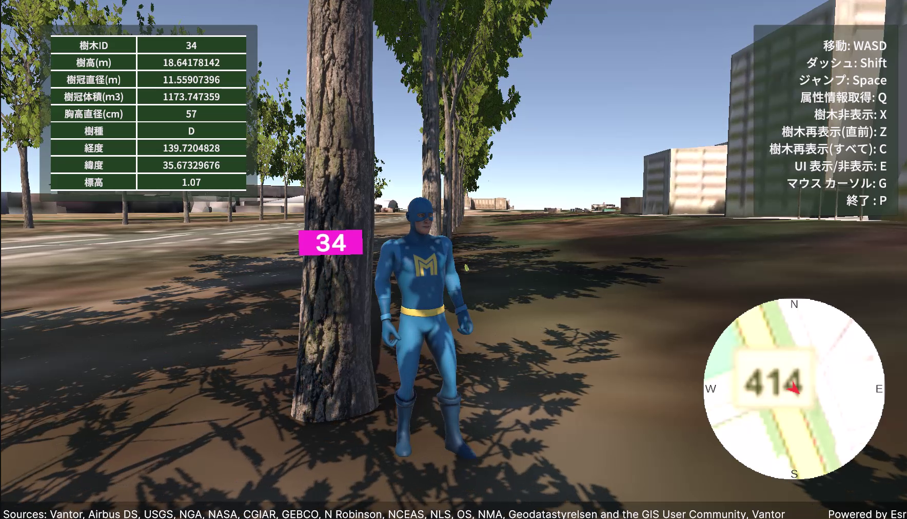

### 表示する立木の CSV の設定
本プロジェクトでは、CSV ファイルで立木の位置や属性を管理しています。
本プロジェクトで利用している[サンプル データ](./3DForestViewer/Assets/StreamingAssets/Obayashi_2451_WGS84_0226.csv)は、[大林組技術研究所内の雑木林](https://www.obayashi.co.jp/obytri/facility/natural-wood/)の立木情報です。
別の立木を表示する際には、下記のカラム名で CSV を作成してください。

|カラム名|カラム詳細|
|----|----|
| 樹木_ID | 樹木別に用意された一意の ID |
| 樹高 (m) | 樹木の高さ |
| 樹冠直径 (m) | 樹冠の横幅 (枝張り) の長さ |
| 樹冠体積 (m3) | 樹冠が占める空間の容積値 |
| 胸高直径 (cm) | 胸の高さの幹の直径 (太さを表す) |
| 樹種_ID | 樹種を示す ID。サンプルの ID は A~E の 5 種類をランダムに配置|
| 経度 | 樹木の位置の経度 |
| 緯度 | 樹木の位置の緯度 |
| 標高 | 樹木の位置の標高 (メートル) |

用意した CSV は、プロジェクト フォルダー内の `Assets\StreamingAssets` 内に配置することで、`TreeCsvReader.cs` で読み込まれます。
このとき、読み込まれる CSV は 1 つのみとなるため、表示したい立木情報の CSV を配置してください。また、欠損値が含まれている行は自動的に除外されます。

### 既存の樹木モデルを削除
変更前の CSV で読み込んだ樹木モデルを下記の手順で削除します。

1. 上部メニューの [ツール (Tools) ] をクリック
2. [樹木 (Trees) ] をクリック 
3. [Clear All Trees] をクリック

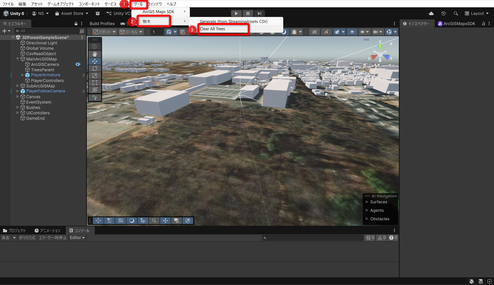

### 初期位置の設定を変更
初期位置を変更します。
設定方法は下記の手順で行ってください。

#### プレイヤーの初期位置の変更
プレイヤーの初期位置を変更します。
始めに地図の中心点を変更し、表示する地図の範囲を変更します。

1. `MainArcGISMap` の中心点の変更
    1. [ ヒエラルキー (hierarchy) ] ウィンドウで `MainArcGISMap` をクリック
    2. [ インスペクター (inspector) ] ウィンドウで `ArcGIS Map` コンポーネントの `Origin Position` を変更

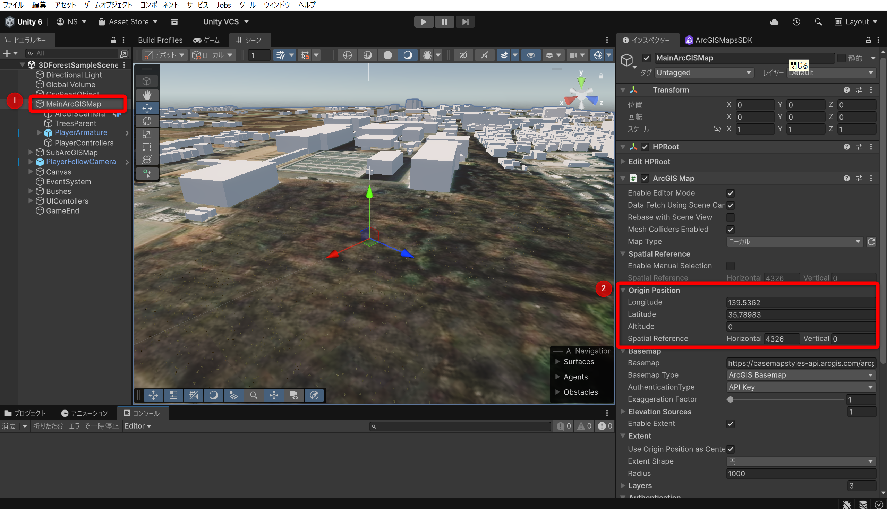

本プロジェクトでは、`ArcGISCamera` の位置がプレイヤーの初期位置に紐づいているため、`MainArcGISMap` の子オブジェクトである `PlayerArmature` の `ArcGIS Location` コンポーネント内の値を変更することで、アプリ実行時にプレイヤーの初期位置に地図が表示されます。

2. `PlayerArmature` の変更
    1. [ ヒエラルキー (hierarchy) ] ウィンドウで `MainArcGISMap` > `PlayerArmature` をクリック
    2. [ インスペクター (inspector) ] ウィンドウで `ArcGIS Location` コンポーネントの `Position` を変更

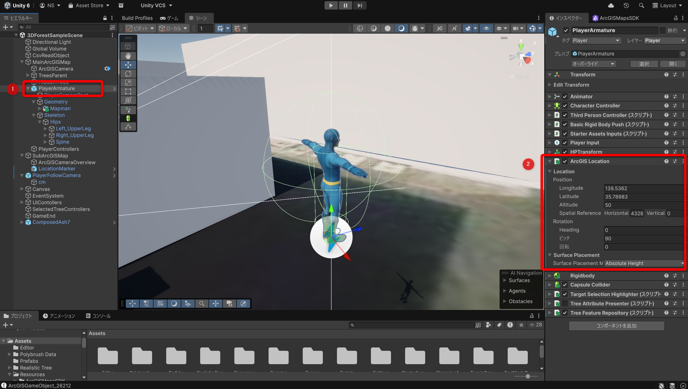

> [!NOTE]
> プレイヤーの高さはデフォルトでは 50 となっています。初期位置の標高に応じて、`Altitude` を変更する必要があります。その地点の標高値 (メートル) を参考に高さを設定することをお勧めします。

#### ミニマップの中心点を変更
アプリ右下のミニマップも、プレイヤーの初期位置に合わせる必要があるため、こちらも変更します。
ミニマップを表示しなくても良い場合は、`SubArcGISMap` を非表示にしてください。

1. `SubArcGISMap` の中心点の変更
    1. [ ヒエラルキー (hierarchy) ] ウィンドウで `SubArcGISMap` をクリック
    2. [ インスペクター (inspector) ] ウィンドウで `ArcGIS Map` コンポーネントの `Origin Position` を変更

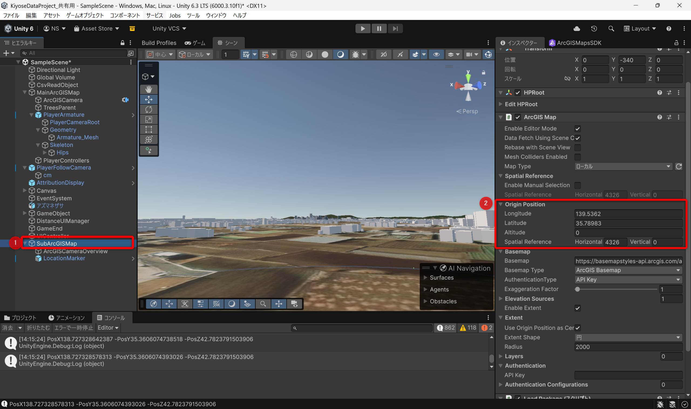

2. `ArcGISCameraOverview` の変更
    1. [ ヒエラルキー (hierarchy) ] ウィンドウで `SubArcGISMap` > `ArcGISCameraOverview` をクリック
    2. [ インスペクター (inspector) ] ウィンドウで `ArcGIS Location` コンポーネントの `Position` を変更

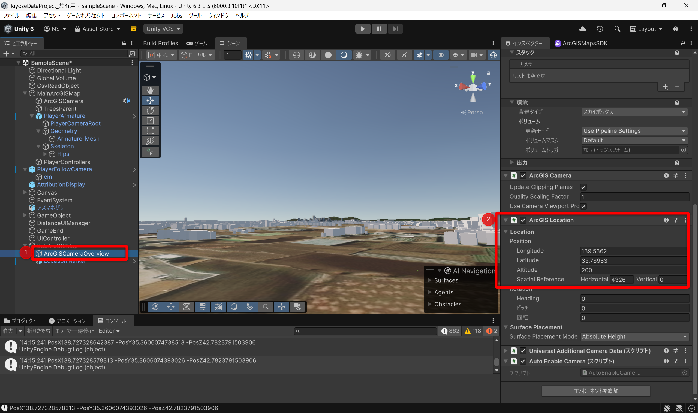

`LocationMarker` は、プレイヤーの移動に合わせてミニマップ上を移動します。

3. `LocationMarker` の変更
    1. [ ヒエラルキー (hierarchy) ] ウィンドウで `SubArcGISMap` > `LocationMarker` をクリック
    2. [ インスペクター (inspector) ] ウィンドウで `ArcGIS Location` コンポーネントの `Position` を変更

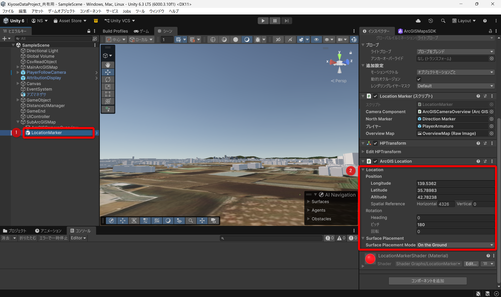

### 参照するレイヤーの変更
本プロジェクトでは、立木以外のデータも利用しています。下記に記載した [ArcGIS Living Atlas of the World®](https://livingatlas.arcgis.com/ja/home/) で配信されているサービスとローカル上に配置する Scene Layer Package (以下、SLPK) を利用しています。
使用しているレイヤーは下記の通りです。

- ArcGIS Living Atlas of the World
    - [清瀬市  3D 都市モデル Project PLATEAU (3D Object Scene Layer)](https://arcgis.com/home/item.html?id=c8afaef19d0b451ca38ddb161c332010)
    - [Terrain 3D (Elevation Layer)](https://www.arcgis.com/home/item.html?id=7029fb60158543ad845c7e1527af11e4)
- ローカル データ
    - 雑木林内の道 (3D Object Scene Layer)

これらを変更する場合の設定方法をご紹介します。

#### 3D Object Scene Layer の変更
本プロジェクトでは、雑木林周辺の環境を Project PLATEAU の 3D 都市モデルで表現しています。 

他の[ 3D 都市モデル (Project PLATEAU)](https://livingatlas.arcgis.com/ja/browse/?q=PLATEAU#d=2&q=PLATEAU) も 3D Object Scene Layer として利用できます。変更手順は下記の通りです。

1. [ ヒエラルキー (hierarchy) ] ウィンドウで `MainArcGISMap` をクリック
2. [ インスペクター (inspector) ] ウィンドウで `ArcGIS Map` コンポーネントの `Layers` をクリック
3. `Layers` の [ソース (Source) ] を利用したいアイテム URL に変更

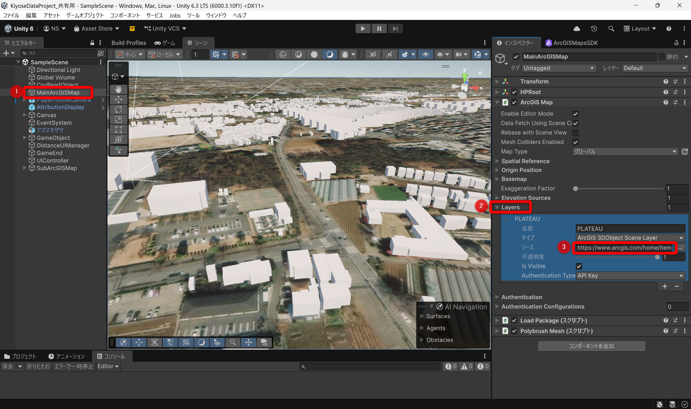

また、ローカル データとして[大林組技術研究所内の雑木林](https://www.obayashi.co.jp/obytri/facility/natural-wood/)内の道を表現した [3D Object Scene Layer Package](https://pro.arcgis.com/ja/pro-app/latest/help/sharing/overview/scene-layer-package.htm) を利用しています。3D Object Scene Layer の SLPK を作成する方法は、[3D オブジェクト シーン レイヤー コンテンツの作成](https://pro.arcgis.com/ja/pro-app/latest/tool-reference/data-management/create-3d-object-scene-layer-package.htm)を参考にしてください。
作成した SLPK は、プロジェクト フォルダー内の `Assets\StreamingAssets` 内に配置することで、`LoadPackage.cs` で読み込むよう設定されています。

#### Elevation Layer の変更
本プロジェクトでは、地形の起伏の表現として Terrain 3D の Elevation Layer を使用していますが、点群のスキャン データ (LAS など) から作成した独自の DEM を利用することも可能です。
利用する DEM については、Elevation Layer として ArcGIS ポータル上に公開するか ArcGIS Pro で TPKX ファイルを作成する必要があります。
TPKX の作成手順については、[マップ タイル パッケージの作成](https://pro.arcgis.com/ja/pro-app/latest/tool-reference/data-management/create-map-tile-package.htm)を参考にしてください。
作成した TPKX は、プロジェクト フォルダー内の `Assets\StreamingAssets` 内に配置することで、`LoadPackage.cs` で読み込むよう設定されています。
このとき、読み込まれる TPKX は 1 つのみとなるため、利用したい TPKX を配置してください。

#### 樹木モデルの再生成
すべて変更し終わったら、最後に樹木モデルを再生成します。[樹木モデルのシーン追加](#樹木-モデルのシーン追加)の手順で、
新しく配置した CSV に対応するモデルを生成してください。

## ライセンス
Copyright 2026 Esri Japan Corporation.

Apache License Version 2.0(「本ライセンス」) に基づいてライセンスされます。あなたがこのファイルを使用するためには、本ライセンスに従わなければなりません。本ライセンスのコピーは下記の場所から入手できます。

> http://www.apache.org/licenses/LICENSE-2.0

適用される法律または書面での同意によって命じられない限り、本ライセンスに基づいて頒布されるソフトウェアは、明示黙示を問わず、いかなる保証も条件もなしに「現状のまま」頒布されます。本ライセンスでの権利と制限を規定した文言については、本ライセンスを参照してください。  
ライセンスのコピーは本リポジトリの[ライセンス ファイル](./LICENSE)で利用可能です。

また、本プロジェクトでは Unity Asset Store で配布されているアセットを使用しています。  
これらのアセットは Apache License 2.0 ではなく、[Unity Asset Store End User License Agreement (EULA)](https://unity.com/legal/as-terms) に基づき各ユーザーが個別に取得・利用する必要があります。  
本リポジトリには、Unity Asset Store で配布されている EULA に基づくアセットのデータは含まれていません。

ESRIジャパン株式会社は、Unity Technologies またはその関連会社がスポンサーとなっているものでも、提携しているものでもありません。Unity は、米国およびその他の国における Unity Technologies またはその関連会社の商標または登録商標です。
